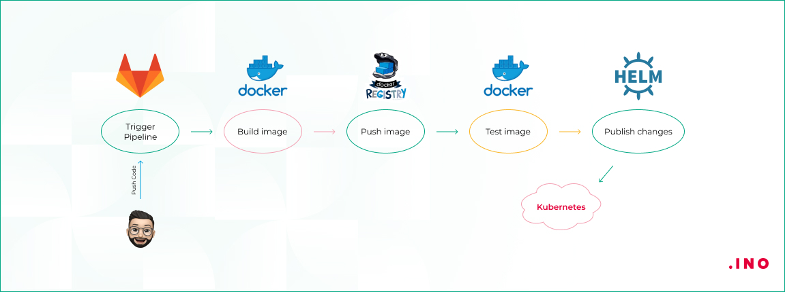

# CI/CD в Kubernetes. Интеграция с Jenkins, GitLab CI, или другими CI/CD-инструментами

## Введение

CI/CD (Continuous Integration/Continuous Delivery) - набор принципов и современных
практик, без которого в современном мире тяжело представить многие проекты.
Эта концепция стала неотъемлемой частью жизненного цикла приложений - в больших проектах,
в которые вливаются десятки коммитов от разных людей в большой команде, очевидно,
для гарантийной работоспособности кода, нужен такой инструмент, как CI/CD.

И особенно это актуально в контексте современных инфраструктурных решений,
таких как Kubernetes, где масштабируемость, гибкость и автоматизация играют решающую роль.

В контексте кластеров, CI/CD обеспечивает более эффективное управление
контейнеризированными приложениями, ускоряет циклы разработки и повышает устойчивость систем.

Однако, для полноценной реализации CI/CD в Kubernetes необходимо использовать
соответствующие инструменты, которые обеспечивают автоматизацию процессов
интеграции, тестирования и развертывания. В данной статье мы рассмотрим
интеграцию CI/CD в Kubernetes на примере популярных инструментов,
таких как Jenkins и GitLab CI, а также рассмотрим другие современные решения,
спроектированные для оптимизации процессов CI/CD в среде контейнеризации.
Давайте глубже погрузимся в мир автоматизации разработки и узнаем,
каким образом эти инструменты совместно способствуют созданию
эффективных и надежных поставок программного обеспечения в Kubernetes.

## Общая концепция

Ниже буде описана примерная концепция передачи нового состояния путем применения
манифестов Kubernetes, например, Helm-чартов (технологии, облегчающей управление
кластером Kubernetes путем объединения его сущностей в так называемый Helm Char,
и последующим запуском, используя утилиту командной строки helm. Подробнее про helm
можно почитать в [документации](https://helm.sh/ru/)). Далее мы будем
упоминать именно их в статье.


В кластере Kubernetes есть механизм, который следит за Git-репозиторием,
и в случае изменения в нём кода, этот механизм приводит кластер в состояние,
чётко описанное этим кодом. Весь данный процесс мы будем называть "Доставкой кода".

Доставка кода в Kubernetes включает в себя ряд шагов, которые
обеспечивают непрерывную поставку изменений в кластер Kubernetes.

1. Разработчик пушит изменения в Git-репозиторий. В нашем случае это, например, GitLab.
При этом, в этом же репозитории у нас лежат наши Helm-чарты. Мы можем их хранить
и в отдельном репозитории, но тогда нужно будет дополнительно воспользоваться,
например, хуками в GitLab для активации выкладки с измененными параметрами
после сборки образа (В случае с GitLab CI все намного проще, об этом в отдельной
вырезке, посвященной непосредственно гитлабу).
2. Изменения в коде триггерят активацию пайплайна сборки
(инструмент тут не важен, дело в концепции). Активация пайплайна заставляет
сборщик собрать новый образ приложения и опубликовать его в реестре
контейнеров. Для версионирования используются, например, теги в Docker.
3. Образ проходит автоматические тесты (или другие операции, обязательные
при сборке нашего приложения, указанные в нашем CI/CD инструменте).
4. После этого мы разворачиваем наш релиз.
5. Если что-то пошло не так, есть куча инструментов (Например rollback в Helm)
для быстрого отката сборки.

Примерно так выглядит стандартная схема деплоя приложения в наш кластер.

Теперь попробуем рассмотреть этот процесс на конкретных примерах.

## Пример 1. Jenkins + Helm + GitLab

Jenkins - современная, одна из популярнейших на данный момент систем для работы
с CI/CD. Она предоставляет обширные возможности настройки с использованием
плагинов для интеграции с различными инструментами и технологиями, в том числе и
для Kubernetes.

Jenkins может автоматизировать сборку и развертывание приложений в
Kubernetes-кластере, что упрощает процессы разработки и управления инфраструктурой.

Рассмотрим подробнее предварительные шаги для работы Jenkins в нашем кластере:

- Авторизация и доступ. Для доступа к нашему кластеру предлагается создать сервисный
аккаунт и пространство имён для Jenkins. Для этого можно настроить
следующий serviceAccount.yaml среди наших манифестов:

```yaml
    ---
    apiVersion: rbac.authorization.k8s.io/v1
    kind: ClusterRole
    metadata:
      name: admin-jenkins
    rules:
      - apiGroups: [""]
        resources: ["*"]
        verbs: ["*"]
    ---
    apiVersion: v1
    kind: ServiceAccount
    metadata:
      name: admin-jenkins
      namespace: devops-tool-suite
    ---
    apiVersion: rbac.authorization.k8s.io/v1
    kind: ClusterRoleBinding
    metadata:
      name: admin-jenkins
    roleRef:
      apiGroup: rbac.authorization.k8s.io
      kind: ClusterRole
      name: admin-jenkins
    subjects:
    - kind: ServiceAccount
      name: admin-jenkins
      namespace: devops-tool-suite
```

- Файловое хранилище. Для хранения файлов, используемых дженкинсом, следует
использовать PVC с настройкой доступа ReadWriteOnce (этот том создается исключительно
для Jenkins, нам не нужны доступы из других подов. Если мы хотим масштабировать
Jenkins (эта тема потянет на отдельную статью), можно использовать ReadWriteMany)
Так же его можно использовать для отсутствия необходимости в повторной подгрузке
зависимостей при создании нового пода (об этом ниже).
- В конце концов, нужно установить непосредственно сам Jenkins в наш кластер,
и запустить его.

Теперь, Jenkins имеет доступ к нашему кластеру, и готов к работе.

Сама настройка в рамках данной статьи нас не особо интересует - все процессы
регулируются внутри нашего Jenkinsfile отдельными stage - запуск тестов, компиляции,
обновление чарта Helm, обновление образа в Docker Registry. Вот пример stage для
деплоя в определенное окружение:

```groovy
stage('Deploy to target enviroment') {
    steps {
        container('helm-cli') {
            script {
                dir ("${params.GIT_REPO}") {
                    sh "./helm/setRevision.sh ${params.VERSION}"
                    def registryIp = sh(script: 'getent hosts registry.kube-system | awk \
                    \'{ print $1 ; exit }\'', returnStdout: true).trim()
                    sh "/helm upgrade ${params.ENV}-${params.GIT_REPO.toLowerCase()} helm \
                    --install --namespace ${params.ENV} --set registry=${registryIp}"
                }
            }
        }
    }
```

Следует обсудить отдельно компиляцию приложений с большим количеством зависимостей.
Для каждой сборки Jenkins может создавать новый под, в случае,
например, условного maven, зависимости будут каждый раз скачиваться заново.
Чтобы избежать этого, следует использовать ReadWriteMany PVC, и монтировать к нему под,
осуществляющий сборку пакетов.

## Пример 2. Helm + GitLab (GitLab CI)

GitLab CI работает довольно просто. В силу того, что ваш код вы храните непосредственно
на GitLab, интегрировать в него пайплайны с автотестами и компиляцией довольно просто -
достаточно прописать в корне `.gitlab-ci.yml` - и вы победитель!

Так ли все просто при интеграции Kubernetes? Давайте разбираться!

Положим в данном случае, что у нас есть отдельный репозиторий с манифестами.
В первую очередь открыт вопрос с доступом - как GitLab получает
санкционированный доступ к нашему кластеру?

Для этого следует установить GitLab agent в ваш кластер Kubernetes. После установки,
в ваших пайплайнах на GitLab вы сможете использовать Kubernetes API. На этом можно было
бы и закончить эту часть статьи, ибо, по сути, все процессы сборки и деплоя
регулируются в нашем `.gitlab-ci.yml`. Но все же стоит обсудить реализацию получения
доступа к кластеру, и понять, как это именно работает

Например, как обстоят дела с безопасностью и доступом агента GitLab к нашему
кластеру? Может ли он получить несанкционированный доступ к недоступным ему
пространствам имён, или другим кластерам? На этот вопрос есть ответ в документации
к GitLab CI/CD:

- Каждый агент имеет отдельный контекст (в Kubernetes контекст - это комбинация кластера,
пользователя и пространства имен, которая используется для выполнения операций).
- Только проект, в котором настроен агент, и любые дополнительные авторизованные
проекты, могут получить доступ к агенту в вашем кластере.

Пример настройки `.gitlab-ci.yml` для получения контекста агентом:

```yaml
deploy:
  variables:
    KUBE_CONTEXT: my-context # The name to use for the new context
    AGENT_ID: 1234 # replace with your agent's numeric ID
    K8S_PROXY_URL: https://<KAS_DOMAIN>/k8s-proxy/
  before_script:
    - kubectl config set-credentials agent:$AGENT_ID --token="ci:${AGENT_ID}:${CI_JOB_TOKEN}"
    - kubectl config set-cluster gitlab --server="${K8S_PROXY_URL}"
    - kubectl config set-context "$KUBE_CONTEXT" --cluster=gitlab --user="agent:${AGENT_ID}"
    - kubectl config use-context "$KUBE_CONTEXT"
  # ... rest of your job configuration
```

Как можно увидеть, принципы GitLab CI/CD в связке с Kubernetes ничем особенным
не выделяются с обеих сторон:

- Для работы с GitLab в кластере, как для многих других сервисов, требующих доступ
к кластеру следует установить в ваш кластер нужную утилиту, используя, например,
тот же Helm.
- Для работы с Kubernetes в GitLab, после получения санкционированного доступа к кластеру,
достаточно начать прописывать в `.gitlab-ci.yml` нужные нам команды.

Безопасность - главное, что хотелось тут обсудить. Безусловно, есть способы еще
сильнее автоматизировать взаимодействие этих двух "гигантов", например,
[Kubernetes executor](https://docs.gitlab.com/runner/executors/kubernetes.html),
но особого смысла в рамках данной статьи это не имеет - главное было понять суть

## Заключение

В рамках данной статьи мы еще раз погрузились в мир микросервисов с Kubernetes,
а так же в мир CI/CD с Jenkins и GitLab CI. Kubernetes существует довольно давно
относительно мира IT, и можно в очередной раз убедиться, как хорошо многие
полезные инструменты ладят друг с другом.

Надеюсь, дорогие читатели, вам было полезно ознакомиться с базой полноценной
автоматизации деплоя крупномасштабных связанных проектов на примере этих инструментов.
На примере компании, в которой я работаю, и его облака с сотней связанных
сервисов могу сказать, что все эти инструменты правда применяются, и без них
чувствуешь себя, как без рук. Поэтому освоение этого стека, особенно в связке
друг с другом, делают из вас сильного командного программиста с широкими
возможностями!

## Источники

<https://habr.com/ru/companies/domclick/articles/577964/> \
<https://inostudio.com/blog/articles-devops/kontseptsii-dostavki-koda-v-kubernetes/> \
<https://docs.gitlab.com/ee/user/clusters/agent/ci_cd_workflow.html> \
<https://www.jenkins.io/> \
<https://kubernetes.io/> \
<https://helm.sh/> \
<https://github.com/jenkinsci/kubernetes-plugin> \
<https://docs.gitlab.com/ee/user/clusters/agent>
